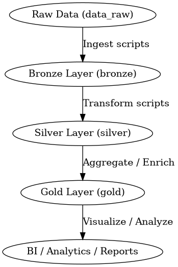

# Ecommerce Lakehouse Data Pipeline

## Overview

This project implements a **Data Lakehouse** for an eCommerce platform. It demonstrates a complete data engineering workflow from ingestion to transformation and aggregation using **Python, Pandas, and Airflow**.

The pipeline is designed to handle raw order data, process it through **bronze**, **silver**, and **gold** layers, and generate analytics-ready datasets.

---

## Project Structure

```
ecom-lakehouse/
│
├── airflow/
│   ├── dags/
│   │   └── ecom_pipeline_dag.py        # Airflow DAG definition
│   └── logs/                           # Airflow logs
│
├── data/
│   ├── raw/                            # Raw generated CSVs
│   ├── bronze/                         # Converted Parquet files
│   ├── silver/                         # Cleaned/Transformed data
│   └── gold/                           # Final aggregated outputs
│
├── scripts/
│   ├── generate_data.py                # Simulates e-commerce data
│   ├── csv_to_parquet.py               # Converts CSV → Parquet
│   ├── partition_bronze.py             # Adds partitions
│   ├── transform_silver.py             # Cleans data
│   └── gold_aggregations.py            # Creates aggregated KPIs
│
└── README.md

```

---

## ETL Pipeline Layers

1. **Bronze Layer** – Raw ingestion of order data.
2. **Silver Layer** – Cleaned and transformed datasets.
3. **Gold Layer** – Aggregated and analytics-ready datasets.

---

## Airflow DAGs

* `bronze_ingest` – Ingest raw data into the Bronze layer.
* `silver_transform` – Transform and clean Bronze data into Silver layer.
* `gold_aggregate` – Aggregate Silver data to Gold layer for analytics.

---

## How to Run

1. Install Python dependencies:

```bash
pip install -r requirements.txt
```

2. Initialize Airflow:

```bash
export AIRFLOW_HOME=~/ecom-lakehouse/airflow
airflow db init
```

3. Start Airflow scheduler:

```bash
airflow standalone
```

4. Trigger the DAG:

```bash
airflow dags trigger ecom_orders_pipeline
```

---

## Pipeline Diagram



---

## Author

**Matthew Lawrence L**


Email: [lawrence82773824@gmail.com](mailto:lawrence82773824@gmail.com)


GitHub: [https://github.com/MatthewLawrencel](https://github.com/MatthewLawrencel)

---

## Notes

* This project is designed for learning and demonstrating **data engineering best practices**.
* Use this project as a reference for building end-to-end ETL pipelines with **Airflow and Python**.
# ecom-lakehouse
